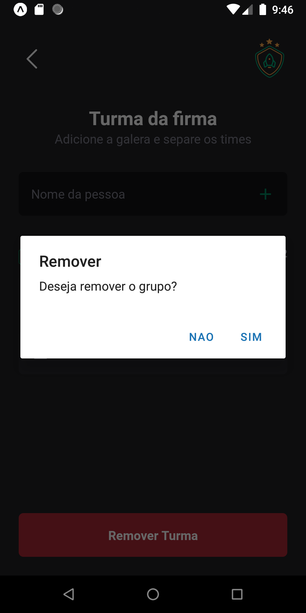

# Ignite Teams App


<br>


## Sobre o aplicativo
O aplicativo foi desenvolvido para organizar jogadores em suas devidas turmas.<br>
É possivel adicionar jogadores e remover os jogadores ou as turmas.

## Como usar?
Instale o SDK do android e o plataform tools (Instalar o [Android Studio](https://developer.android.com/studio) é mais fácil )\
Clone o repositório
```bash
  git clone https://github.com/nunees/ignite-teams.git
```
Instale as dependencias
```bash
  npm install
```

Execute o emulador
```bash
npm run android
```

## O que foi usado?
- Styled Components
- Uso de ThemeProvider
- Fontes personalizadas (Roboto)
- Async Storage
- Uso de estados (useState) e referências (useRef) e renderização (useEffect)
- Tratamento e lançamento de exceções
- Uso de Stack Navigation (ReactNavigation) para navegar entre telas

## Capturas de tela
### Tela inicial

<br />
<br />

### Adicionar nova turma

<br />
<br />

### Tela da turma

<br />
<br />

### Adicionando jogadores

<br />
<br />

### Remoção da turma

<br />
<br />